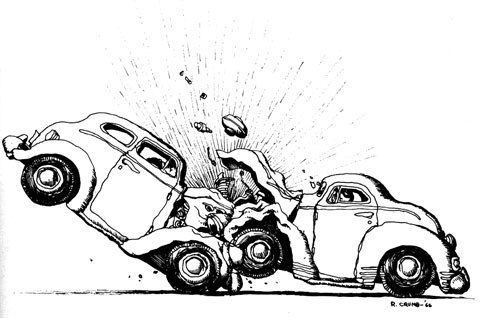

```{r setup, include=FALSE}
knitr::opts_chunk$set(echo = FALSE)
options(digits = 3)
```

```{r, echo=FALSE, message=FALSE, warning=FALSE} 
library(dplyr)
library(readr)
library(ggplot2)
library(plotly)
library(forcats)
Crash <- read_csv("monroe-county-crash-data2003-to-2015.csv")
```

```{r, echo=FALSE, message=FALSE, warning=FALSE}
library(lubridate)
library(dplyr)
library(stringr)
library(plotly)
tmp <- Crash %>%
  mutate(hm = sprintf("%04d", Hour),
         hour = str_sub(hm, 1, 2) %>% parse_number(),
         minute = str_sub(hm, 3, 4) %>% parse_number()) %>%
  mutate(wday = c("Sunday", "Monday", "Tuesday", "Wednesday", "Thursday", "Friday", "Saturday")[Day],
         wday_dec = Day + hour/24)
```

## Introduction {.smaller}
  - Automobiles are an indispensable part of life. 
  - Thanks to them that travel, transaction, business, and even medical problems has been improving.
  - But they also carry risks that affect human life.
  
  
  
## Monroe County {.smaller} 
- Part of the Bloomington, Indiana.
- It was formed in 1818, and named after the fifth President of the United States, James Monroe.
- The 2010 United States Census report that the population was 137,974.
- The total area is 411.32 square miles, which 95.91% is land and 4.09% is water.


## Data explornation {.smaller}
- Accidents reported in Monroe County from 2003 to 2015.
- More than 53.000 cases.
- Some factors:
  + Day/ Month/ Year/ Hour (that accidents occurred). 
  + Collision type: Type of vehicles involved?  
  + Injury Types: Fatal, incapacitating, no injury/ unknown, and non-incapacitating.
  + Primary factors that cause accidents: Following too closely, unsafe backing, etc.


## Topic Ideas: {.smaller}
- Some questions I want to find out through the data include:
  + Which year has the highest rate of accident? On what month? Is that month consistent for all other years? 
  + Is there any specific day (or month, year) with more accidents than the other day (month/ year)? 
  + On that day (month/ year), what is the primary factor that causes the accident? What are the highest injuries? 
  + What can we conclude about driving habit of citizen of Monroe county?

## Year {.smaller}

```{r, echo=FALSE, message=FALSE, warning=FALSE}
tmp %>%
  group_by(Year) %>%
  summarize(count = n()) %>%
  ungroup() %>%
  ggplot(aes(x = Year, y = count)) + 
  geom_bar(stat="identity", fill="brown") + 
  geom_text(aes(label=count), vjust=1.6, color="white", size=3.5)+
  ggtitle("Which year has the highest rate accidents?") +
  theme_minimal()
  
```


  
## Month {.smaller}

```{r, echo=FALSE, message=FALSE, warning=FALSE}
p<-tmp %>%
  group_by(Month, Year) %>%
  summarize(count = n()) %>%
  ungroup() %>%
  ggplot(aes(x = Month, y = count)) + 
  geom_line(aes(frame=Year))+
  ggtitle("Accidents month by month") 
ggplotly(p)

```

## Day and time {.smaller}

```{r, echo=FALSE, message=FALSE, warning=FALSE}
library(plotly)
p<-tmp %>%
  group_by(hour, `wday`, Year) %>%
  summarize(count = n()) %>%
  ungroup() %>%
  ggplot(aes(x = hour, y = count, color = `wday`)) + 
  geom_line(aes(frame = Year))+
  ggtitle("Day and time")
ggplotly(p)

```


## Weekday or weekend? {.smaller}

```{r, echo=FALSE, message=FALSE, warning=FALSE}
library(plotly)
p<-tmp %>%
  group_by(hour, `Weekend?`, Year) %>%
  summarize(count = n()) %>%
  ungroup() %>%
  ggplot(aes(x = hour, y = count, color = `Weekend?`)) + 
  geom_line(aes(frame = Year))+
  ggtitle("Weekend or weekdays?")
ggplotly(p)

```

## Injury types {.smaller}

```{r, echo=FALSE, message=FALSE, warning=FALSE}
library(plotly)
p<-tmp %>%
  group_by(hour, `Injury Type`, Year) %>%
  summarize(count = n()) %>%
  ungroup() %>%
  ggplot(aes(x = hour, y = count, color = `Injury Type`)) + 
  geom_line(aes(frame = Year))+
  ggtitle("Type of injuries")
ggplotly(p)

```

## How many vehicles involved? {.smaller}

```{r, echo=FALSE, message=FALSE, warning=FALSE}
library(plotly)
p<-tmp %>%
  group_by(hour, `Collision Type`, Year) %>%
  summarize(count = n()) %>%
  ungroup() %>%
  ggplot(aes(x = hour, y = count, color = `Collision Type`)) + 
  geom_line(aes(frame = Year))+
  ggtitle("Vehicles involved")
ggplotly(p)

```

## Primary factor {.smaller}

```{r, fig.height=12, fig.width=8, echo=FALSE, message=FALSE, warning=FALSE}
ggplot(tmp, aes(x = fct_rev(fct_infreq(`Primary Factor`)))) + 
  geom_bar(fill="steelblue")+
  ggtitle("Primary factors of accidents, 2003 to 2015") +
  theme_minimal()+ coord_flip()
```


## Conclusion

## Sources

[1] https://en.wikipedia.org/wiki/Monroe_County,_Indiana